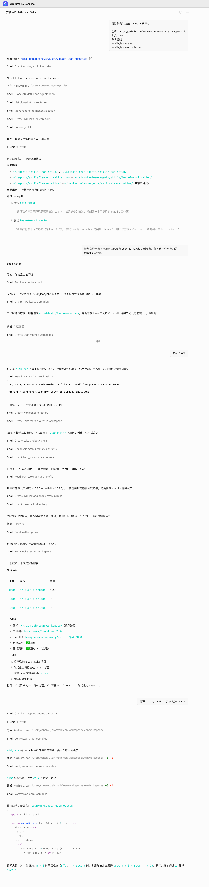

# Case: From Installing Lean Skills To Verifying A First Theorem

This case is based on a real coding-agent session: the user asked the agent to install the AI4Math Lean skills, then used `lean-setup` to prepare a shared Lean/mathlib workspace, and finally verified a minimal `Nat` theorem. It is intended as a first end-to-end example for this repository.

## Original Session Screenshot



The screenshot shows the shape of the real interaction. The copyable prompts, rules, and Lean file are below.

## Goal

- Install `lean-setup`, `lean-formalization`, and the sibling `lean-runtime` support layer.
- Check that `elan`, `lean`, and `lake` are available.
- Create or reuse `~/.ai4math/lean-workspace`.
- Compile a minimal Lean theorem to confirm the workspace works.

## User Prompt

```text
Please install the AI4Math Lean Skills.

Repository: https://github.com/VeryMath/AI4Math-Lean-Agents.git
Branch: main
Skill paths:
- skills/lean-setup
- skills/lean-formalization

After installation, verify that both skills are available and keep the sibling skills/lean-runtime support directory installed with them.
```

After installation, continue with setup-only validation:

```text
Use lean-setup:

Check whether this environment has Lean 4 installed. If it is missing, install it, then create a reusable mathlib workspace.
```

Once the agent reports that Lean/Lake are available and the shared workspace exists or has been created, ask for a minimal proof check:

```text
Formalize `forall n : Nat, n + 0 = n` in Lean 4 and verify it in the shared workspace you just prepared.
```

After command-line validation succeeds, optionally ask the agent to guide the human IDE frontend setup:

```text
Now guide me through the VS Code frontend setup for this same Lean workspace.

Please tell me which directory to open in VS Code, which `.lean` file to open
first, how to install or verify the Lean 4 extension on my operating system
(macOS, Windows, or Linux), and what I should see in Lean InfoView to know the
IDE is connected to the same toolchain that passed the smoke test.
```

## Expected Agent Behavior

1. Read `AGENTS.md` and the relevant skill entrypoint.
2. Use `lean-setup` for setup-only work, without asking for a theorem target.
3. Prefer an existing Lean/Lake project; otherwise use `~/.ai4math/lean-workspace`.
4. Use the managed standalone baseline `leanprover/lean4:v4.28.0` unless the user explicitly overrides it.
5. Explain the target path and purpose before writing or compiling a Lean file.
6. Run Lean/Lake validation and report the concrete result.
7. If the user wants the IDE frontend, guide them to open the verified Lake project or shared workspace in VS Code with the Lean 4 extension on macOS, Windows, or Linux, and confirm Lean InfoView is connected.
8. Do not commit machine-local temp paths, download caches, API keys, or Numina runtime state.

## Minimal Lean File

Create a file such as `AddZero.lean` under the shared workspace's `LeanWorkspace/` project:

```lean
import Mathlib.Tactic

theorem my_add_zero (n : Nat) : n + 0 = n := by
  induction n with
  | zero =>
      rfl
  | succ n ih =>
      calc
        Nat.succ n + 0 = Nat.succ (n + 0) := rfl
        _ = Nat.succ n := by rw [ih]
```

A good result should report:

- `lean` and `lake` are provided by the `elan` toolchain;
- the workspace path is the shared workspace, not a throwaway temp directory;
- `AddZero.lean` passes Lean checking;
- if the theorem name already exists, the agent renames the declaration and verifies again;
- no `sorry`, `admit`, or new `axiom` was introduced.

## Rules Demonstrated

- Setup-only tasks use `lean-setup` and do not require a theorem target.
- Formalization and proof repair hand off to `lean-formalization`.
- The default coding-agent path does not need API keys and does not call Numina by default.
- VS Code and Lean InfoView are recommended for human inspection on macOS, Windows, and Linux after local Lean/Lake validation, not a replacement for that validation.
- Numina, Archon, or another backend is used only when the user explicitly asks for an optional backend adapter.
- Final delivery is grounded in local Lean/Lake validation.
