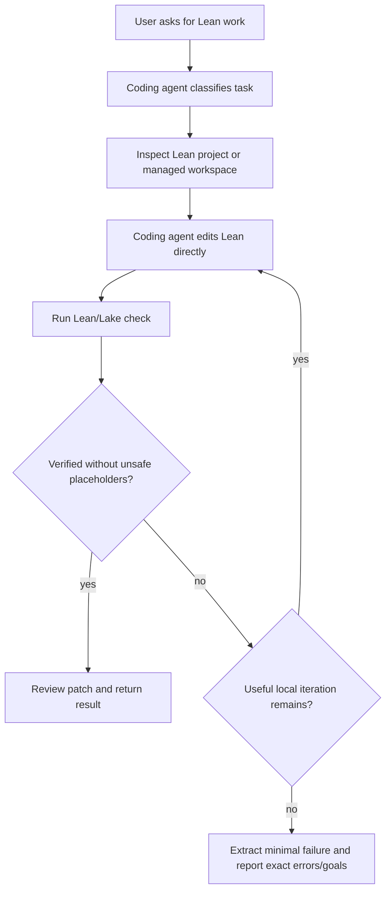

# Numina Reverse Analysis for AI4Math

This reference records what was distilled from the public Numina Lean Agent workflow and what remains delegated to the optional official runtime. For deployment/call instructions, use `numina_runtime.md`.

## Source Scope

- Public repository: https://github.com/project-numina/numina-lean-agent
- Result repository: https://github.com/project-numina/Numina-Putnam2025
- Paper reference: https://arxiv.org/abs/2601.14027

The goal is not to copy Numina prompts or reimplement Numina proof search. The goal is to extract reusable workflow patterns for direct coding-agent Lean work.

## Distilled Patterns

1. Use a coding agent as the Lean worker, not merely as a chat layer.
2. Keep Lean/Lake validation as the correctness oracle.
3. Treat theorem statement preservation as a first-class safety check.
4. Work in bounded rounds with a clear stopping condition.
5. Preserve structured run state: task type, target, changed files, validation result, remaining errors/goals, and next action.
6. When blocked, reduce the problem to the smallest useful failing Lean fragment.
7. Prefer reusable Lean workspaces so setup cost is not paid on every standalone problem.

## What Is Optional Runtime State

The default AI4Math loop still works without these runtime dependencies:

- upstream Numina repository checkout;
- Numina Python environment;
- external prover backend command construction;
- model endpoint configuration;
- API-key or login setup;
- backend round streaming or benchmark execution.

When the user wants original Numina behavior, those concerns are handled by the official upstream checkout under `.ai4math/numina-runtime/` and the human-in-the-loop flow in `numina_runtime.md`.

## Adapted Direct Workflow

## AI4Math Skill Mapping

| Numina-inspired idea | Direct AI4Math implementation |
| --- | --- |
| Environment gate before proof attempts | `env`, `doctor`, `configure`, `check` |
| Structured task envelope | `direct_task.py` and JSON schemas |
| Bounded proof rounds | `max_local_iterations` / `max_rounds` |
| Statement drift guard | `validate_patch.py` |
| Placeholder guard | `detect_sorry.py` and `review` |
| Minimal blocked artifact | `extract_minimal_failure.py` |
| Reusable project context | `.ai4math/lean-workspace` |

## Failure Lessons

- Standalone Lean files need a project context; the skill supplies a managed workspace.
- Long proof attempts should wait until a natural-language statement has been translated and confirmed.
- A patch that proves an easier theorem is a failure unless the user approved the statement change.
- Partial progress is valuable only when the remaining Lean errors/goals are preserved precisely.

## Practical Rule

If a future agent reads this file during normal Lean work, the default action item is:

1. use the direct skill CLI to verify local Lean readiness;
2. edit Lean directly;
3. run Lean/Lake checks frequently;
4. review safety constraints;
5. return a verified patch or minimal failure.

If the user asks for original Numina behavior, switch to `numina_runtime.md`, explain setup/call implications, and validate all resulting Lean changes locally.
