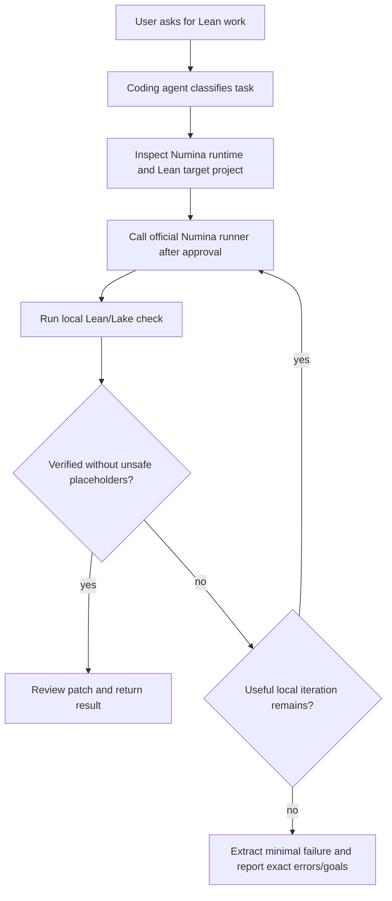

# Numina Reverse Analysis for AI4Math

This reference records how this skill delegates Lean Agent behavior to the public Numina Lean Agent workflow and keeps local Lean validation around it. For deployment/call instructions, use `numina_runtime.md`.

## Source Scope

- Public repository: https://github.com/project-numina/numina-lean-agent
- Result repository: https://github.com/project-numina/Numina-Putnam2025
- Paper reference: https://arxiv.org/abs/2601.14027

The goal is not to copy Numina prompts or reimplement Numina proof search. The goal is to call the official Numina runtime as the Lean Agent and use reusable AI4Math guardrails around setup, workspace choice, and validation.

## Distilled Patterns

1. Use Numina as the Lean Agent for proof search/formalization.
2. Keep Lean/Lake validation as the correctness oracle.
3. Treat theorem statement preservation as a first-class safety check.
4. Work in bounded rounds with a clear stopping condition.
5. Preserve structured run state: task type, target, changed files, validation result, remaining errors/goals, and next action.
6. When blocked, reduce the problem to the smallest useful failing Lean fragment.
7. Prefer reusable Lean workspaces so setup cost is not paid on every standalone problem.

## Runtime State

The default AI4Math Lean Agent loop expects these runtime dependencies for official Numina calls:

- upstream Numina repository checkout;
- Numina Python environment;
- external prover backend command construction;
- model endpoint configuration;
- API-key or login setup;
- backend round streaming or benchmark execution.

Those concerns are handled by the official upstream checkout under `${AI4MATH_HOME:-~/.ai4math}/numina-runtime/` and the human-in-the-loop flow in `numina_runtime.md`. Local direct Lean work remains available only as validation or fallback.

## Numina-Orchestrated Workflow

## AI4Math Skill Mapping

| Numina idea | AI4Math implementation |
| --- | --- |
| Environment gate before proof attempts | `env`, `doctor`, `configure`, `check` |
| Official runner invocation | `${AI4MATH_HOME:-~/.ai4math}/numina-runtime/upstream` with documented Numina commands |
| Bounded proof rounds | `max_local_iterations` / `max_rounds` |
| Statement drift guard | `validate_patch.py` |
| Placeholder guard | `detect_sorry.py` and `review` |
| Minimal blocked artifact | `extract_minimal_failure.py` |
| Reusable project context | `${AI4MATH_HOME:-~/.ai4math}/lean-workspace` |

## Failure Lessons

- Standalone Lean files need a project context; the skill supplies a managed workspace.
- Long proof attempts should wait until a natural-language statement has been translated and confirmed.
- A patch that proves an easier theorem is a failure unless the user approved the statement change.
- Partial progress is valuable only when the remaining Lean errors/goals are preserved precisely.

## Practical Rule

If a future agent reads this file during normal Lean work, the default action item is:

1. verify Numina runtime/auth readiness;
2. prepare the target in the user's Lake project or shared workspace;
3. explain and call the official Numina runner after approval;
4. validate resulting Lean changes locally;
5. return a verified patch or minimal failure.
