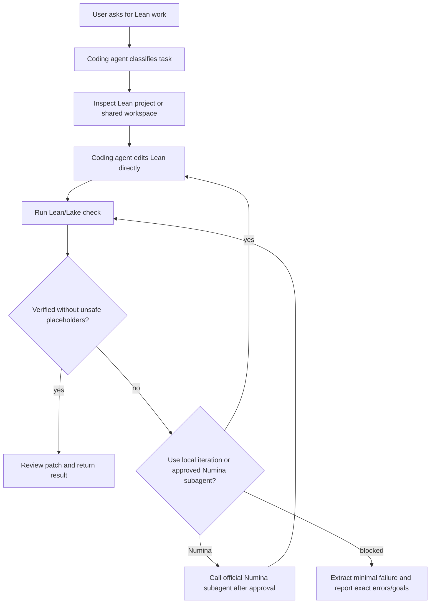

# Numina and Lean-Specialist Agent Distillation

This reference records what this coding-agent Lean skill learns from the public Numina Lean Agent workflow, and how those lessons fit the broader Lean-specialist agent pattern library in `specialist_agent_patterns.md`. For deployment/call instructions, use `numina_runtime.md`.

## Source Scope

- Public repository: https://github.com/project-numina/numina-lean-agent
- Result repository: https://github.com/project-numina/Numina-Putnam2025
- Paper reference: https://arxiv.org/abs/2601.14027

The goal is not to copy Numina prompts or reimplement Numina proof search. The goal is to distill reusable Lean-agent mechanisms into a comprehensive coding-agent skill while preserving a deployable path to the official Numina runtime when the user wants a subagent.

## Distilled Patterns

1. Use a coding agent as the primary Lean worker, with Numina available as an optional subagent.
2. Keep Lean/Lake validation as the correctness oracle.
3. Treat theorem statement preservation as a first-class safety check.
4. Work in bounded rounds with a clear stopping condition.
5. Preserve structured run state: task type, target, changed files, validation result, remaining errors/goals, and next action.
6. When blocked, reduce the problem to the smallest useful failing Lean fragment.
7. Prefer reusable Lean workspaces so setup cost is not paid on every standalone problem.

## Optional Runtime State

The default AI4Math coding-agent loop does not require these runtime dependencies, but the optional official Numina subagent path does:

- upstream Numina repository checkout;
- Numina Python environment;
- external prover backend command construction;
- model endpoint configuration;
- API-key or login setup;
- backend round streaming or benchmark execution.

Those concerns are handled by the official upstream checkout under `${AI4MATH_HOME:-~/.ai4math}/numina-runtime/` and the human-in-the-loop flow in `numina_runtime.md`.

## Coding-Agent-First Workflow

## AI4Math Skill Mapping

| Numina idea | AI4Math implementation |
| --- | --- |
| Environment gate before proof attempts | `env`, `doctor`, `configure`, `check` |
| Official runner invocation | Optional `${AI4MATH_HOME:-~/.ai4math}/numina-runtime/upstream` with documented Numina commands |
| Bounded proof rounds | `max_local_iterations` / `max_rounds` |
| Statement drift guard | `validate_patch.py` |
| Placeholder guard | `detect_sorry.py` and `review` |
| Minimal blocked artifact | `extract_minimal_failure.py` |
| Reusable project context | `${AI4MATH_HOME:-~/.ai4math}/lean-workspace` |

## Failure Lessons

- Standalone Lean files need a project context; the skill supplies a managed workspace.
- Long proof attempts should wait until a natural-language statement has been translated and confirmed.
- A patch that proves an easier theorem is a failure unless the user approved the statement change.
- Partial progress is valuable only when the remaining Lean errors/goals are preserved precisely.

## Practical Rule

If a future agent reads this file during normal Lean work, the default action item is:

1. verify local Lean readiness;
2. prepare the target in the user's Lake project or shared workspace;
3. edit/check directly as a coding agent;
4. use official Numina only if the user asks for the subagent path or it is approved;
5. return a verified patch or minimal failure.
